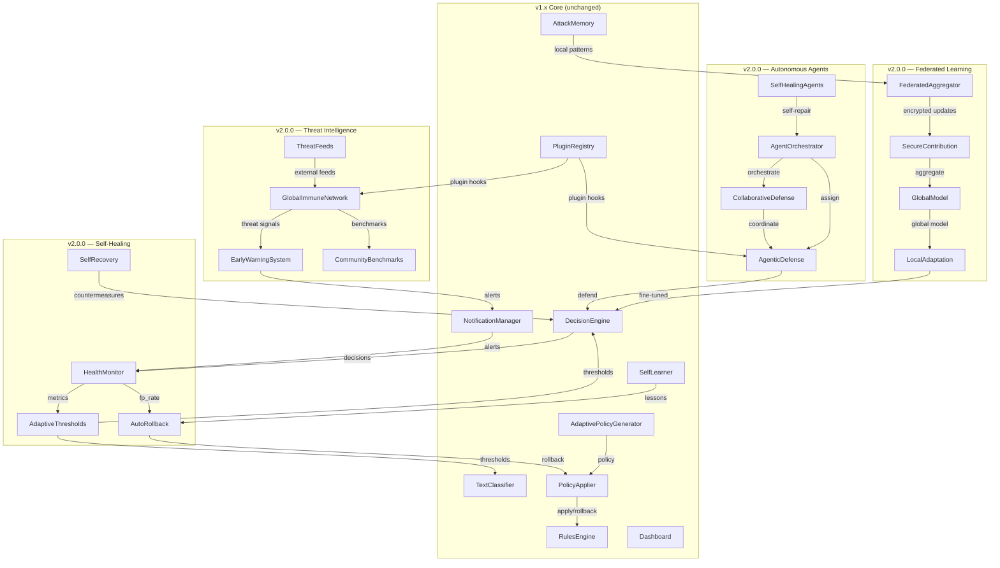

# Hestia Shield v2.0.0 — Architecture



---

## Component Interactions

### Phase 1: Self-Healing Systems

```
                ┌──────────────────┐
                │  DecisionEngine  │
                │  (existing)      │
                └────────┬─────────┘
                         │ decisions
                         ▼
                ┌──────────────────┐
        ┌──────►│   HealthMonitor  │◄─────── alerts ──────────┐
        │       │  (sliding window)│                           │
        │       └────────┬─────────┘                           │
        │                │                                     │
        │    ┌───────────┴────────────┐                        │
        │    ▼                        ▼                        │
        │ ┌──────────────┐  ┌──────────────────┐              │
        │ │AutoRollback  │  │AdaptiveThresholds│              │
        │ │(rollback on  │  │(dynamic risk     │              │
        │ │ high FP)     │  │ thresholds)      │              │
        │ └──────┬───────┘  └────────┬─────────┘              │
        │        │                   │                         │
        │        ▼                   ▼                         │
        │ ┌──────────────┐  ┌──────────────────┐              │
        │ │PolicyApplier │  │ Classifier/DE    │              │
        │ │(rollback)    │  │(update thresh)   │              │
        │ └──────────────┘  └──────────────────┘              │
        │                                                     │
        └─────────────────────────────────────────────────────┘
                          SelfRecovery
                      (countermeasures on
                       confirmed attacks)
```

### Phase 2: Federated Learning

```
Tenant A              Tenant B              Tenant C
┌──────────┐         ┌──────────┐         ┌──────────┐
│LocalModel│         │LocalModel│         │LocalModel│
└────┬─────┘         └────┬─────┘         └────┬─────┘
     │ encrypted          │ encrypted          │ encrypted
     │ update             │ update             │ update
     ▼                    ▼                    ▼
┌─────────────────────────────────────────────────────┐
│              FederatedAggregator                     │
│  (secure aggregation, no raw data exposed)           │
└──────────────────────┬──────────────────────────────┘
                       │ global model update
                       ▼
              ┌──────────────────┐
              │   GlobalModel    │
              │ (shared threat   │
              │  detection)      │
              └──────────────────┘
                       │
          ┌────────────┼────────────┐
          ▼            ▼            ▼
     ┌──────────┐ ┌──────────┐ ┌──────────┐
     │Tenant A  │ │Tenant B  │ │Tenant C  │
     │Fine-tune │ │Fine-tune │ │Fine-tune │
     └──────────┘ └──────────┘ └──────────┘
```

### Phase 3: Real-Time Threat Intelligence

```
External Feeds          GlobalImmuneNetwork          Tenants
┌────────────┐         ┌──────────────────┐        ┌──────────┐
│CVE Feeds   │────────►│                  │◄───────│ Tenant A │
├────────────┤         │  Pub/Sub Network │────────►│ Tenant B │
│OSINT       │────────►│                  │◄───────│ Tenant C │
├────────────┤         │  (threat signals │        └──────────┘
│Vendor APIs │────────►│   + benchmarks)  │
└────────────┘         └────────┬─────────┘
                                │
                                ▼
                       ┌──────────────────┐
                       │EarlyWarningSystem│
                       │(predict & alert) │
                       └────────┬─────────┘
                                │ alerts
                                ▼
                       ┌──────────────────┐
                       │NotificationMgr   │
                       │(existing)        │
                       └──────────────────┘
```

### Phase 4: Autonomous Security Agents

```
┌──────────────────────────────────────────────────┐
│               AgentOrchestrator                   │
│  (lifecycle, assignment, coordination)            │
└──────┬─────────────────────┬─────────────────────┘
       │                     │
       ▼                     ▼
┌──────────────┐    ┌──────────────────┐
│AgenticDefense│    │SelfHealingAgents │
│(patrol,      │    │(self-patch,      │
│ detect,      │◄──►│ self-update)     │
│ respond)     │    └──────────────────┘
└──────┬───────┘
       │
       ▼
┌──────────────────┐
│CollaborativeDef. │
│(cross-agent      │
│ coordination)    │
└──────────────────┘
```

---

## Data Flow: Self-Healing Decision Cycle

```
1. DecisionEngine evaluates a prompt/tool
2. Decision is recorded in AttackMemory
3. HealthMonitor reads decision + outcome
   ─ Computes FP rate over sliding window (last N decisions)
   ─ Computes average latency
   ─ Computes block ratio
4. If FP rate > threshold (default 5%):
   ─ AutoRollback triggers PolicyApplier.rollback()
   ─ PolicyApplier reverts to last known good state
   ─ HealthMonitor checkpoint restored
5. AdaptiveThresholds evaluates:
   ─ If FP rate > 5%: LOWER all risk thresholds (reduce sensitivity)
   ─ If FN rate > 2%: RAISE all risk thresholds (increase sensitivity)
   ─ Thresholds clamped to [0.1, 0.95] range
6. SelfRecovery on confirmed attacks:
   ─ Identify attack vector from AttackMemory
   ─ Deploy temporary countermeasure (rate limit, block pattern)
   ─ Log and alert via NotificationManager
```

---

## Key Design Decisions

| Decision | Rationale |
|----------|-----------|
| HealthMonitor as standalone component | Can be slotted into any flow without modifying DecisionEngine internals |
| Checkpoint-based rollback | Full state snapshots allow clean revert without replaying history |
| Thresholds clamped to [0.1, 0.95] | Prevents oscillation to extreme values |
| Federated learning via encrypted updates | No raw data ever leaves tenant boundary |
| Agent orchestration via plugin system | Existing hook points enable agent injection without core changes |
| Pub/sub for threat intelligence | Decouples producers and consumers; scales horizontally |

---

## Configuration

All v2.0.0 components follow the existing pattern of environment variable configuration:

```bash
# Self-Healing
HESTIA_HEALING_ENABLED=true
HESTIA_HEALING_FP_THRESHOLD=0.05
HESTIA_HEALING_CHECKPOINT_INTERVAL=100
HESTIA_HEALING_AUTO_ROLLBACK=true

# Federated Learning
HESTIA_FEDERATED_ENABLED=true
HESTIA_FEDERATED_CONTRIBUTION_INTERVAL=3600
HESTIA_FEDERATED_AGGREGATOR_URL="https://aggregator.hestia.shield/v1"
HESTIA_FEDERATED_MIN_PARTICIPANTS=3

# Threat Intelligence
HESTIA_THREAT_INTEL_ENABLED=true
HESTIA_THREAT_INTEL_PUBSUB_URL="redis://threat-intel:6379"
HESTIA_THREAT_INTEL_FEEDS="cve,osint,vendor"

# Autonomous Agents
HESTIA_AGENTS_ENABLED=true
HESTIA_AGENTS_PATROL_INTERVAL=300
HESTIA_AGENTS_MAX_CONCURRENT=5
```
